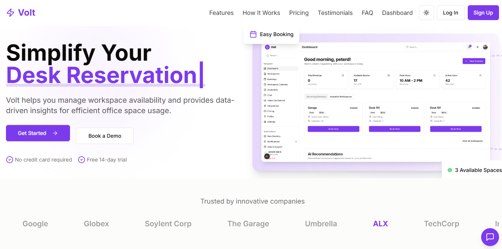

# Volt — Workspace Booking Platform

A scalable booking platform for reserving desks, meeting rooms, and event halls, with real-time availability, role-based access control, and an AI-powered booking assistant.



## Live Demo

Demo available on request — infrastructure is spun up on demand rather than kept running continuously.

## Tech Stack

**Frontend:** Next.js, Tailwind CSS, React Context API
**Backend:** Django REST Framework (Python), JWT authentication
**Database:** PostgreSQL (Azure Database for PostgreSQL)
**Container Registry:** Azure Container Registry
**Orchestration:** Kubernetes (k3s)
**CI/CD:** GitHub Actions
**Infrastructure:** Multi-cloud — Azure (database, container registry) + AWS EC2 (Kubernetes cluster)

## Architecture

```
GitHub Push
    │
    ▼
GitHub Actions (CI/CD)
    │
    ├─► Build backend image  ──► Azure Container Registry
    └─► Build frontend image ──► Azure Container Registry
                                        │
                                        ▼
                            Kubernetes (k3s on AWS EC2)
                            ├── Backend Deployment + Service (NodePort)
                            └── Frontend Deployment + Service (NodePort)
                                        │
                                        ▼
                        Azure Database for PostgreSQL
```

## Deployment Highlights

- **Containerized** both frontend (Next.js) and backend (Django + Gunicorn) with multi-stage Docker builds
- **Automated CI/CD** — every push to `main` triggers GitHub Actions to build and push both images to Azure Container Registry, tagged by build number
- **Kubernetes deployment** using Deployments, Services (NodePort), and Secrets — database credentials and other sensitive config are injected at runtime via Kubernetes Secrets, not hardcoded
- **Horizontal scaling demonstrated** — backend and frontend can be scaled independently:
  ```
  kubectl scale deployment volt-backend --replicas=3
  ```
- **Multi-cloud setup** — PostgreSQL database and container registry hosted on Azure; Kubernetes cluster (k3s) running on AWS EC2, pulling images across cloud providers

## Local Development Setup

### Prerequisites
- Node.js (>=18)
- Python (>=3.10)
- PostgreSQL access (local or cloud)

### Backend
```bash
cd backend
python -m venv venv
source venv/Scripts/activate  # or venv\Scripts\activate on Windows cmd
pip install -r requirements.txt
```

Create a `.env` file in `backend/`:
```
DATABASE_URL=postgres://<user>:<password>@<host>:5432/<database>?sslmode=require
MAILGUN_API_KEY=your-key
MAILGUN_DOMAIN=your-domain
```

```bash
python manage.py migrate
python manage.py createsuperuser
python manage.py runserver
```

### Frontend
```bash
cd frontend
npm install --legacy-peer-deps
npm run dev
```

## Kubernetes Deployment

### 1. Create secrets
```bash
kubectl create secret docker-registry acr-secret \
  --docker-server=<your-registry>.azurecr.io \
  --docker-username=<username> \
  --docker-password=<password>

kubectl create secret generic volt-secrets \
  --from-literal=DATABASE_URL='<connection-string>' \
  --from-literal=MAILGUN_API_KEY='<key>' \
  --from-literal=MAILGUN_DOMAIN='<domain>' \
  --from-literal=ALLOWED_HOSTS='*'
```

### 2. Apply manifests
```bash
kubectl apply -f backend-deployment.yaml
kubectl apply -f frontend-deployment.yaml
```

### 3. Verify
```bash
kubectl get pods
kubectl get svc
```

### 4. Update a deployment with a new image
```bash
kubectl set image deployment/volt-backend volt-backend=<registry>/volt-backend:<new-tag>
```

## Core Features

- User authentication with role-based access (Admin, Employee, Learner)
- Real-time workspace booking (desks, meeting rooms, event halls)
- Email notifications for bookings, reminders, and cancellations
- Admin analytics dashboard for usage and occupancy trends
- AI-powered booking suggestions and natural language booking assistant

## What I Learned / Debugged

- Fixed a Django `ALLOWED_HOSTS` misconfiguration for containerized deployment
- Resolved a PostgreSQL `pgvector` extension requirement for AI embedding features
- Diagnosed and fixed a Gunicorn worker timeout caused by cross-cloud database latency
- Fixed a Next.js `NEXT_PUBLIC_API_URL` build-time environment variable issue that caused the frontend to call the wrong backend
- Fixed a git submodule misconfiguration that silently prevented backend files from being tracked
- Fixed a frontend multi-step form bug where pressing Enter triggered premature form submission
- Configured k3s with `--tls-san` to allow secure remote access from a Kubernetes GUI (Lens)

## License

MIT
